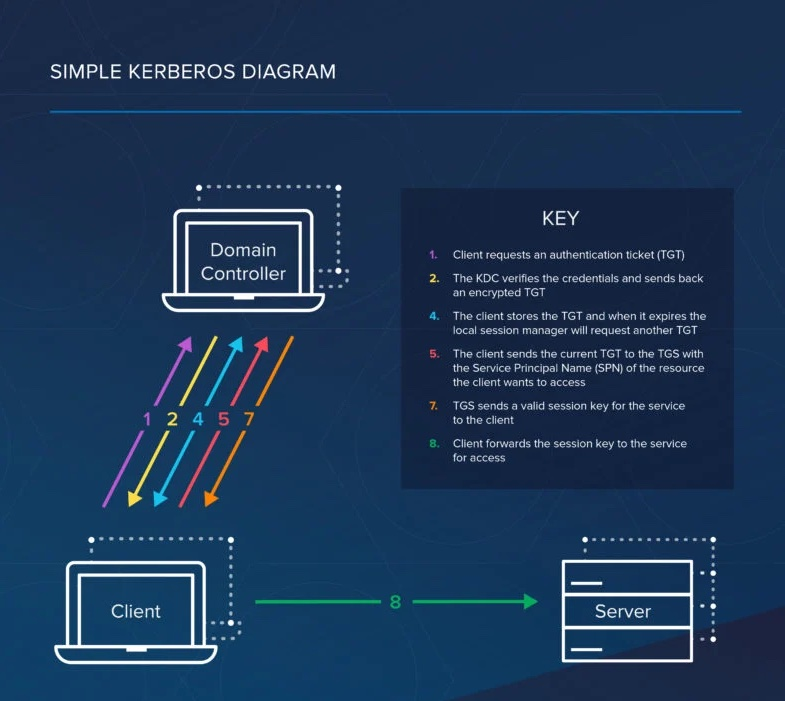

# Kerberos flow 

* Client requests an authentication ticket (TGT) from the Key Distribution Center (KDC)
* The KDC verifies the credentials and sends back an encrypted TGT and session key
* The TGT is encrypted using the Ticket Granting Service (TGS) secret key
* The client stores the TGT and when it expires the local session manager will request another TGT (this process is transparent to the user)

> If the Client is requesting access to a service or other resource on the network, this is the process:

* The client sends the current TGT to the TGS with the Service Principal Name (SPN) of the resource the client wants to access
* The KDC verifies the TGT of the user and that the user has access to the service
* TGS sends a valid session key for the service to the client
* Client forwards the session key to the service to prove the user has access, and the service grants access.

## details flow 

* The very first step for Kerberos security is the initial client authentication request. In this step, the user will ask for a ticket-granting ticket from the authentication server. The client ID will also be included in the request that is sent.
* Next, the credentials of the client are verified by the key distribution center. At first, the authentication server checks whether the client and the ticket-granting server are available or not. If both are available, then the authentications server will generate a client/user secret key. This will employ hash as the user’s password. Then the ticket-granting server secret key is computed by the authentication server. It also creates a session key, which is encrypted by the client/user secret key. Then a ticket-granting ticket is generated by the authentications server, which also contains the client ID, timestamp, session key, lifetime, and client network address. Then, the ticket is encrypted by the Ticker granting a secret server key.
* The client then decrypts the message. The client uses the user/client secret key to decrypt the message. It also extracts the secret key and TGT and also generates the authenticator to validate the TGS of the client.
* Then the client request access using TGT.
* The key distribution center then creates a ticket for the file server. The ticket-granting server uses the secret key for decrypting the ticket-granting ticket that is received from the client. Then the secret key is extracted. Then the authenticator decrypts the ticket-granting ticket and matches it with the client ID and client network address. Also, it uses the timestamp to make sure the ticket is not expired. The key distribution center then creates a service ticket.
* The client then uses the file ticket to authenticate.
* In the final step, the target server receives authentication as well as the decryption.