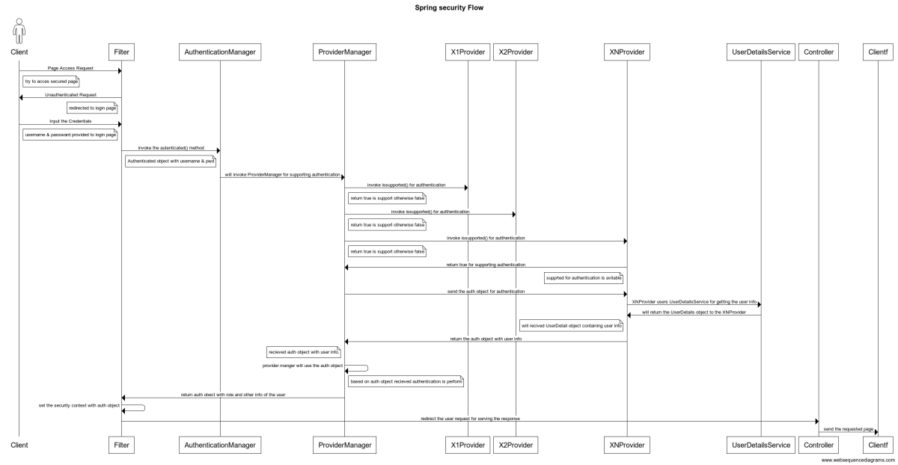
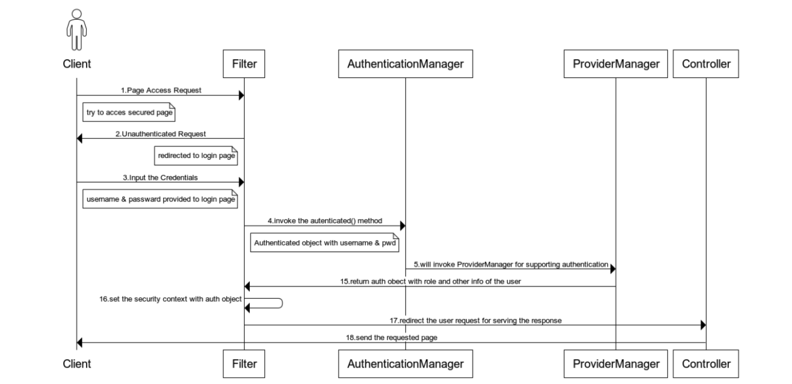
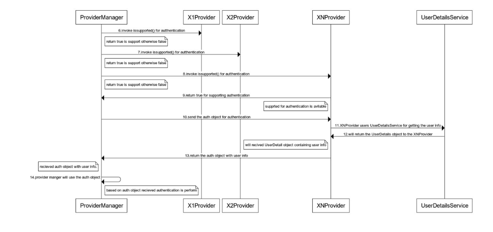
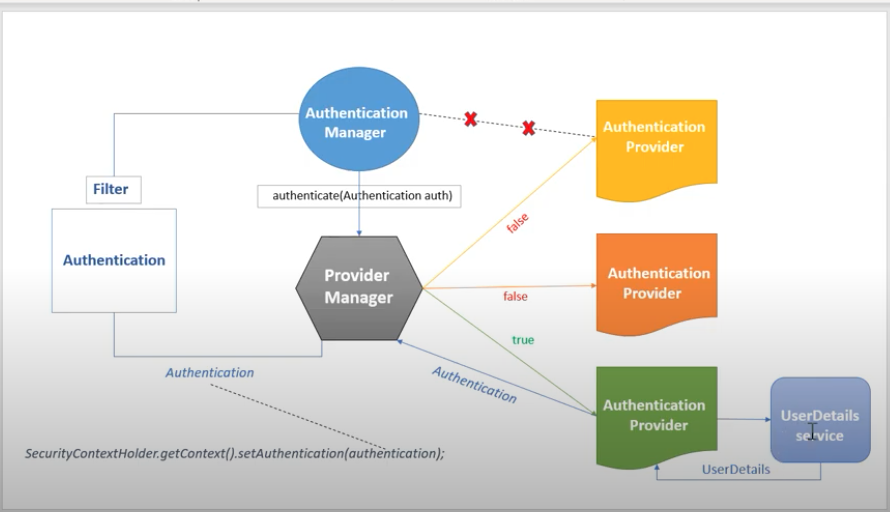

### https://docs.spring.io/spring-security/site/docs/5.4.x-SNAPSHOT/reference/html5/

---
### SPRING SECURITY OBJECTS
---
* 1.Authentication Object 
  	hold Credentials object before authentication
  	hold principal object after authentication 
  	hold Authorties Object list after the authentication
  	boolean flag a authenticated false before authentication
  	and true after authentication process success.

* 2.Principal Object 
  	hold the current user information 
  
* 3.Credentials Object 
	hold the user credentials for authentication. 
	
* 4.UserDetails Object 
	user information like name, Granted Authorties list user lock or unlock 
	and user credentials	
	
* 5.SecurityContext
	it a context object for the spring security which hold the current Principal object 
	which is a ThreadLoad object and available with a current Thread we can get the 
	information like is current user is authenticated and what are the Granted Authorties
	current user has 	
	    
---
### WEB APPLICATION 
---
* 1.security framework bootstrap with the application 

* 2.it intercept the request by filters store the original request in the Request cache 

* 3.flow will start from DelegatingFilterProxy in spring boot security starter 
	its already configured to intercept all the request to the server 
	it will delegate the request to the other filter to intercept in the row 
	their are many filters which execute and every filter has its own purpose. 
	their are filter for authorization skip authentication,header cors or others 
	
* 4.out of many filter one filter is AuthenticationFilter which initiate Authentication flow

* 5.In spring authentication process need input as credentials object and output is 
	principal object in Spring Security their is Authentication Object which hold the 
	credentials before the authentication Process and Principal object after the 
	authentication process.
	
* 6.AuthenticationProvider is actually responsible for actual Authentication process.
	AuthenticationProvider is the spring interface which has method authenticate() 
	at the successful authentication process AuthenticationProvider.authenticate() will 
	clear the credentials from Authenticate object and put the Principal object which hold
	the user information. AuthenticationProvider has supports() which let the others know 
	what kind of authentication this Provider can support.
	
* 7.In Single application their can be multiple AuthenticationProvider which are specific 
	for a type of Authentication eg. LdapAuthenticationProvider, DatabaseAuthenticationProvider
	InMemoaryAuthenticationProvider ,OAuthAuthenticationProvider and so on.
	
* 8.AuthenticationManager has authenticate() which take Authentication object and return the 
	Authentication object their is a specific implementation of AuthenticationManager which 
	is ProviderManger which is very common it will delegate the work to the AuthenticationProvider
	for doing the authentication Process, ProviderManger will search for configured type of 
	authentication and then it will search for the right type of the AuthenticationProvider 
	to perform the authentication by calling AuthenticationProvider.support() 

* 9.AuthenticationProvider.support() will take a Authentication object and return boolean 
	if it support the requested type.
	
* 10.UserDetailsService.loadUser(String username) which connect to the data source eg db 
	ldap , cache or some external service to get the user information and return the 
	UserDetails Object which contains user information like name pwd, authorities etc
	after the authentication success same user details object will be return from the 
	AuthenticationProvider warped in the Authentication Object 	

* 11.if the credentials are not match or authentication is failed then 
	AuthenticationProvider.authenticate() will throw exception which is propagated to the 
	AuthenticationFilter and then configured action is performed and finally 
	AuthenticationFailureHandler will execute if configured. 
	
* 12.Once the  AuthenticationProvider.authenticate() method return the succes then 
	Authentication Object with the UserDetails Object wrapped as Principle object is return 
	and propagated to the AuthenticationFilter then it is saved in the current ThreadLocal
	which is SecurityContext Object will hold the Authentication Object for the further 
	processing of the Authorization. 
	and AuthenticationSuccessHandler will execute if configured 

---
### ExceptionTranslationFilter
---
```
	The ExceptionTranslationFilter allows translation of AccessDeniedException 
	and AuthenticationException into HTTP responses	
```

---
### AuthenticationEntryPoint
---
```
The AuthenticationEntryPoint is used to request credentials from the client
```

---
### LIST OF THE FILER IN SPRING SEUCIRYT

---

* ChannelProcessingFilter
* WebAsyncManagerIntegrationFilter
* SecurityContextPersistenceFilter
* HeaderWriterFilter
* CorsFilter
* CsrfFilter
* LogoutFilter
* OAuth2AuthorizationRequestRedirectFilter
* Saml2WebSsoAuthenticationRequestFilter
* X509AuthenticationFilter
* AbstractPreAuthenticatedProcessingFilter
* CasAuthenticationFilter
* OAuth2LoginAuthenticationFilter
* Saml2WebSsoAuthenticationFilter
* UsernamePasswordAuthenticationFilter
* OpenIDAuthenticationFilter
* DefaultLoginPageGeneratingFilter
* DefaultLogoutPageGeneratingFilter
* ConcurrentSessionFilter
* DigestAuthenticationFilter
* BearerTokenAuthenticationFilter
* BasicAuthenticationFilter
* RequestCacheAwareFilter
* SecurityContextHolderAwareRequestFilter
* JaasApiIntegrationFilter
* RememberMeAuthenticationFilter
* AnonymousAuthenticationFilter
* OAuth2AuthorizationCodeGrantFilter
* SessionManagementFilter
* ExceptionTranslationFilter
* FilterSecurityInterceptor
* SwitchUserFilter


### Flow 




```
title Spring security Flow 
actor Client
Client->Filter: 1.Page Access Request
note right of Client: try to acces secured page 
Filter->Client: 2.Unauthenticated Request 
note left of Filter: redirected to login page 
Client->Filter: 3.Input the Credentials 
note right of Client: username & passward provided to login page 
Filter->AuthenticationManager:4.invoke the autenticated() method 
note right of Filter: Authenticated object with username & pwd
AuthenticationManager->ProviderManager: 5.will invoke ProviderManager for supporting authentication 
ProviderManager->X1Provider: 6.invoke issupported() for autthentication 
note right of ProviderManager: return true is support otherwise false 
ProviderManager->X2Provider: 7.invoke issupported() for autthentication 
note right of ProviderManager: return true is support otherwise false 
ProviderManager->XNProvider: 8.invoke issupported() for autthentication 
note right of ProviderManager: return true is support otherwise false 
XNProvider->ProviderManager: 9.return true for supporting authentication 
note left of XNProvider: supprted for authentication is avliable 
ProviderManager->XNProvider: 10.send the auth object for authentication 
XNProvider-> UserDetailsService: 11.XNProvider users UserDetailsService for getting the user info 
UserDetailsService->XNProvider: 12.will return the UserDetails object to the XNProvider
note left of XNProvider: will recived UserDetail object containing user info
XNProvider->ProviderManager: 13.return the auth object with user info 
note left of ProviderManager: recieved auth object with user info.
ProviderManager->ProviderManager: 14.provider manger will use the auth object
note right of ProviderManager: based on auth object recieved authentication is perform 
ProviderManager->Filter: 15.return auth obect with role and other info of the user 
Filter->Filter: 16.set the security context with auth object 
Filter -> Controller: 17.redirect the user request for serving the response 
Controller->Client: 18.send the requested page 
```
